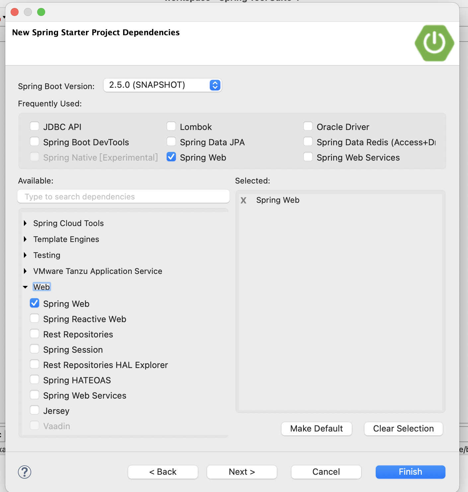
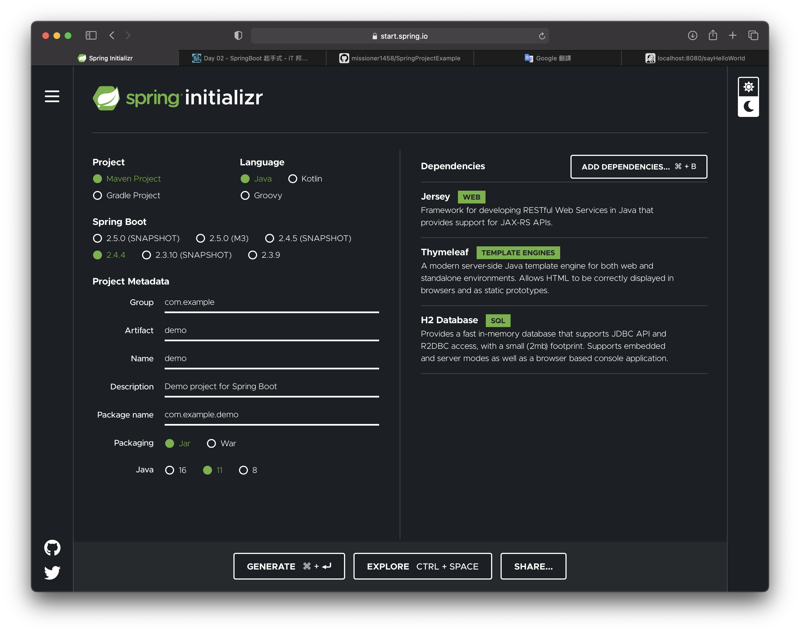
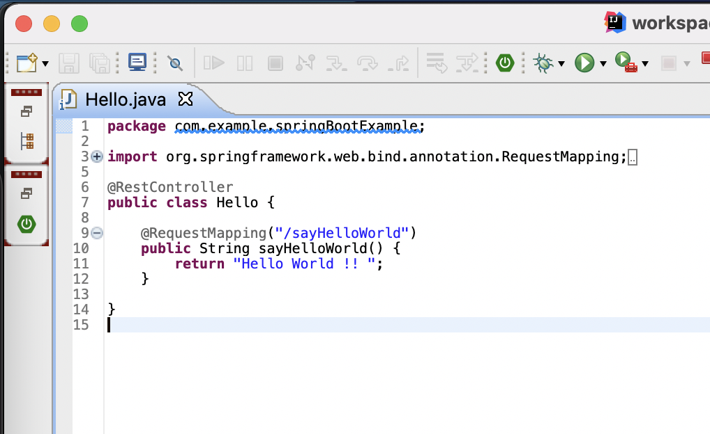
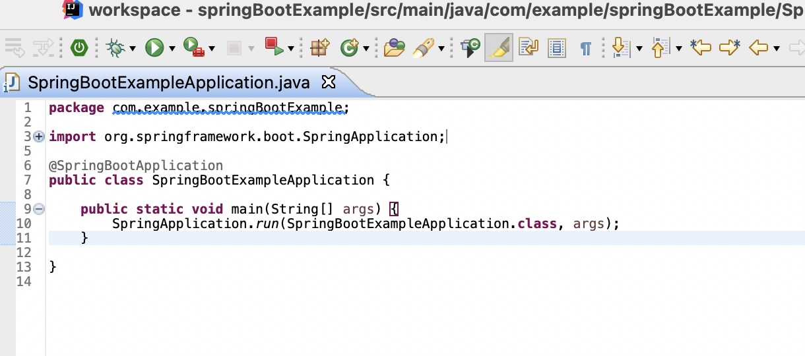
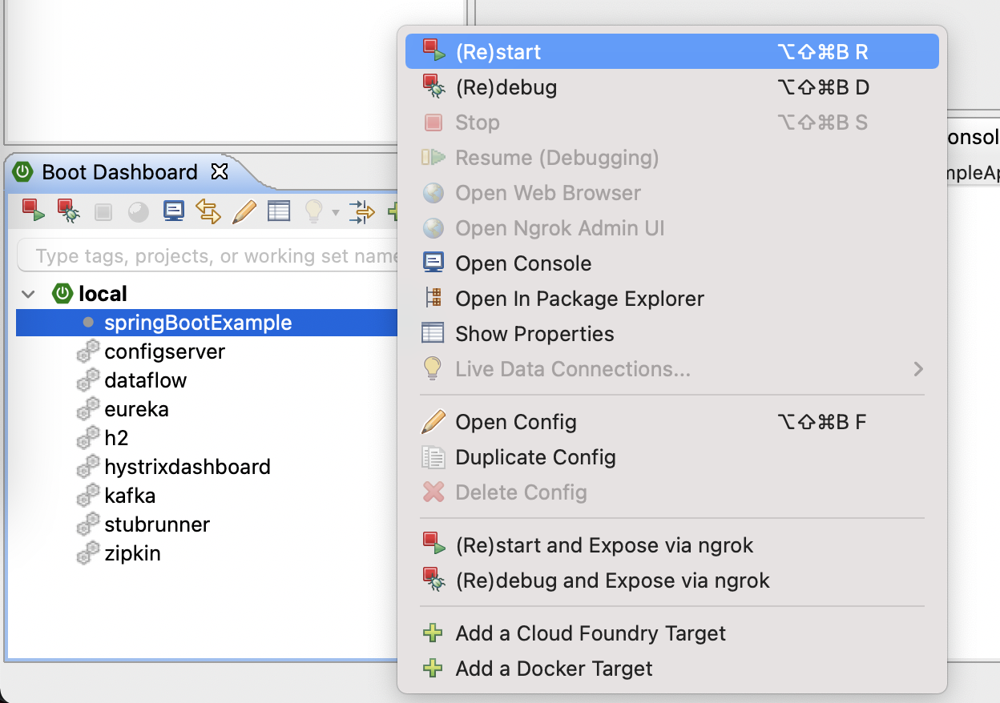
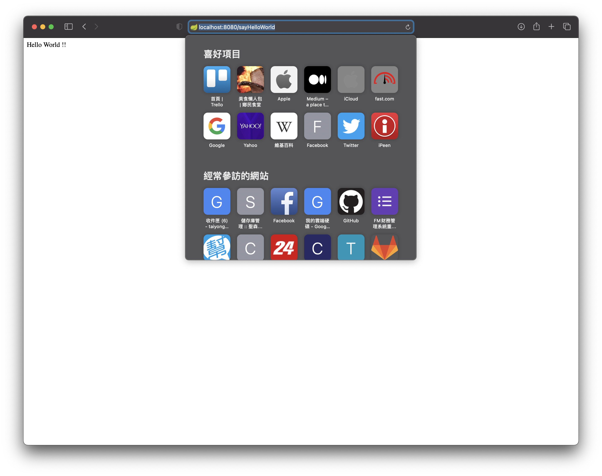

# 使用Spring系列打造小型專案

----

[TOC]

----

## 講師介紹

- 姓名 : 林泰永 (Ted)
- 學歷 : 朝陽科技大學 資訊工程系
- 現職 : 聖森雲端科技股份有限公司 技術主管
- 做過專案 :
  - 勞保局系統重構案、銀行財富管理系統、
    政府公文內部管理系統、醫院病歷系統...等等
- 擅長技術 : Java

----

## 第一章.	Spring Framework  介紹

### 1.	Spring

1. Spring 的核心是個輕量級（Lightweight）容器（Container），實現了IoC（Inversion of Control）模式的容器，基於此核心容器所建立的應用程式，可以達到程式元件的鬆散耦合（Loose coupling），讓程式元件可以進行測試（Testability），這些特性都使得整個應用程式可以在架構上與維護上都能得到相當程度的簡化。

- 輕量級（Lightweight）

  Spring 的核心在檔案容量上只有不到 1MB 的大小，而使用 Spring 核心所需要的資源也是很小的，而 Spring 是個非侵入性（Nonintrusive）框架，它的目的之一，是讓應用程式不感受到框架的存在，減低應用程式從框架移植時的負擔。

- 容器（Container）

  Spring 核心本身是個容器，管理物件的生命週期、物件的組態、相依注入等，並可以控制物件在創建時是以 [原型（Prototype） ](https://openhome.cc/Gossip/DesignPattern/PrototypePattern.htm)或 [單例（Singleton）](https://openhome.cc/Gossip/DesignPattern/SingletonPattern.htm) 的方式來建立。

- IoC（Inversion of Control）

  Spring 的核心概念是IoC，更具體而易懂的名詞是依賴注入（Dependency Injection），使用 Spring，您不必自己在程式碼中維護物件的依賴關係，只需在組態檔中加以設定，Spring 核心容器會自動根據組態將依賴注入指定的物件。


2. 除了這些特性之外，Spring 的目標是實現一個全方位的整合框架，在 Spring 框架下實現多個子框架的組合，這些子框架之間彼此可以獨立，也可以使用其它的框架方案加以替代，Spring 希望提供 one-stop shop 的框架整合方案。

- AOP 框架

  Spring 最為人重視的另一方面是支援AOP（Aspect-oriented programming），然而 AOP 框架只是 Spring 支援的一個子框架，說 Spring 框架是 AOP 框架並不是一件適當的描述，人們對於新奇的 AOP 關注映射至 Spring 上，使得人們對於 Spring 的關注集中在它的 AOP 框架上，雖然有所誤解，但也突顯了 Spring 的另一個令人關注的特色。 

- 持久層

  Spring 提供對持久層的整合，如 JDBC、O/R Mapping工具（Hibernate、iBATIS）、事務處理等。

- Web 框架

  Spring 也提供 Web 框架的解決方案，但您也可以將自己所熟悉的 Web 框架與 Spring 整合，像是 Struts、Webwork 等，都可以與 Spring 整合而成為適用於自己的解決方案。 


3. 對於一些服務，例如 JNDI、Mail、排程、遠程等，Spring 不直接提供實作，而是採取抽象層方式進行包裝，讓這些服務在使用時可以有一致的使用模式且更為方便。 

- Spring Data 處理異質資料庫跟 NoSQL 使用,讓開發者體驗盡量接近一致
- Spring Batch 處理資料的批量處理與流程切割
- Spring Security 安全機制
- Spring HATEOAS Hypermedia as the engine of application state
- Spring REST Docs 將 Rest 輸出成 PDF 或 Html
- Spring AMQP 整合 MQ 的接口
- Spring Session 將狀態儲存到 Redis
- Spring Shell 在本機上可啟用一個 shell 的交互式命令行
- Spring Cloud Data Flow 大資料數據流功能


*註: 版本歷史

第一版由 [Rod Johnson]開發，並在2002年10月發布在 *Expert One-on-One J2EE Design and Development* 一書中。2003年6月，Spring Framework 第一次發布在 Apache 2.0 許可證下。2004年3月，發布了里程碑的版本1.0，2004年9月以及2005年3月，又發布了新的里程碑版本。2006年，Spring Framework 獲得了 [Jolt 生產力獎]和 [JAX 創新獎]。

2006年10月發布Spring 2.0，2007年11月 Spring 2.5，2009年12月 Spring 3.0，2011年 Spring 3.1，2013年11月 Spring 3.2.5，2013年12月發布了4.0版本。值得注意的是，Spring 4.0 版本中增加了對 Java SE 8  , Groovy 2 , Java EE  7 的一些方面以及 WebSocket 的支援。

2017年9月 Spring Framework 正式發布了 5.0 版本，此版本引入了 Spring WebFlux，一個高效能、回應式、非同步的 Web 框架。Spring 5.0 重點加強了對函式語言程式設計、回應式程式設計（reactive programming）的支援能力，是一個非常大的進步。


----

###2.	Spring Web

Spring Web MVC是一種基於Spring實現了Web MVC設計模式的輕量級Web框架，即使用了MVC架構模式的思想，將web層進行職責解耦，基於請求驅動指的就是使用請求-響應模型，框架的目的就是幫助我們簡化開發，Spring Web MVC也是要簡化我們日常Web開發的。

Spring Web MVC也是服務到工作者模式的實現，但進行可優化。前端控制器是DispatcherServlet；應用控制器其實拆為處理器對映器(Handler Mapping)進行處理器管理和檢視解析器(View Resolver)進行檢視管理；頁面控制器/動作/處理器為Controller介面（僅包含ModelAndView handleRequest(request, response) 方法）的實現（也可以是任何的POJO類）；支援本地化（Locale）解析、主題（Theme）解析及檔案上傳等；提供了非常靈活的資料驗證、格式化和資料繫結機制；提供了強大的約定大於配置（慣例優先原則）的契約式程式設計支援。

----

### 3.	Spring Boot

#### Spring Boot 介紹

Spring Boot是由Pivotal團隊在2013年開始研發、2014年4月發布第一個版本。所以它是一個新型的框架。它基於Spring4.0設計，不僅繼承了Spring框架原有的優秀特性，而且還通過簡化配置來進一步簡化了Spring應用的整個搭建和開發過程。另外Spring Boot通過集成大量的框架使得依賴包的版本沖突，以及引用的不穩定性等問題得到了很好的解決。

Spring Boot 讓大家能輕鬆地創建獨立的、(production-grade)耐用又有擴展性的、以Spring為基礎的且能直接運行的應用程序。
針對Spring的平台和第三方library，Spring的官方機構會有個性地為用家提供一個極少煩惱的開始環境。
同時，Spring boot的應用程序只需要很少的Spring 配置。

而所謂的個性就是指它會預設各種合理的默認配置包括放棄了XML、Spring Boot Web 應用程序使用了一個(embedded tomcat container)嵌入式Tomcat容器、可以自定義 Spring Boot 應用程序等。

總括之言，Spring Boot 的目的是提供一組工具，以便快速構建+容易配置的 Spring 應用程序。同時不需要在重新定義基本的配置，從而成為(rapid application development) 快速應該開發的新進領導者。
Spring Boot可以說是在 Java 中開發基於 REST Web 應用程序的最快方法之一。

#### Spring Boot 的特色:

1. 創建獨立的Spring 應用程式
2. 嵌入式Tomcat, Jetty, Undertow (不用部署WAR包)
3. 提出自主的starter來簡化配置
4. 隨時自動地配置Spring及相關的第3方Library
5. 提供已隨時就緒的功能如Metrics, 程式的健康檢查及外部化配置
6. 不會生成任何代碼及無任何XML配置的前設要求

相信大家都對Spring Boot有一點認識，接下來的日子會繼續講相關的基礎知識，
同時也進行各種簡單的實戰，邊學邊用。希望在30天後，大家能將Spring Boot運用在日常學習和工作中。

----

### 4.	Spring Cloud

#### Spring Cloud介紹

1. Spring Cloud簡單介紹Spring Cloud是一系列框架的有序集合。
   它利用Spring Boot的開發便利性巧妙地簡化了分佈式系統基礎設施的開發，如服務發現註冊、配置中心、Message Queue、負載平衡、斷路器、數據監控等，都可以用Spring Boot的開發風格做到一鍵啟動和部署。
   Spring並沒有重複製造輪子，它只是將目前各家公司開發的比較成熟、經得起實際考驗的服務框架組合起來，通過Spring Boot風格進行再封裝屏蔽掉了複雜的配置和實現原理，最終給開發者留出了一套簡單易懂、易部署和易維護的分佈式系統開發工具包。
   微服務是可以獨立部署、水平擴展、獨立訪問（或者有獨立的數據庫）的服務單元，Spring Cloud就是這些微服務的大管家，採用了微服務這種架構之後，項目的數量會非常多，Spring Cloud需要管理好這些微服務。 

2. 官方介紹

   > Spring Cloud provides tools for developers to quickly build some of the common patterns in distributed systems (eg configuration management, service discovery, circuit breakers, intelligent routing, micro-proxy, control bus, one-time tokens, global locks, leadership election, distributed sessions, cluster state). Coordination of distributed systems leads to boiler plate patterns, and using Spring Cloud developers can quickly stand up services and applications that implement those patterns. They will work well in any distributed environment, including the developer's own laptop, bare metal data centres, and managed platforms such as Cloud Foundry.

   Spring Cloud為開發人員提供了快速構建分佈式系統中一些常見模式的工具（例如配置管理，服務發現，斷路器，智能路由，微代理，控制總線，一次性令牌，全局鎖定，領導選舉，分佈式會話，集群狀態）。分佈式系統的協調導致鍋爐板模式，使用Spring Cloud開發人員可以快速站起來實現這些模式的服務和應用程序。它們適用於任何分佈式環境，包括開發人員自己的筆記本電腦，裸機數據中心和Cloud Foundry等託管平台。
   

3.  核心成員概覽

   - 服務註冊中心 - Spring Cloud Netflix Eureka

   - 服務調用方式 - REST API

   - 服務監控 - Spring Boot Admin

   - 斷路器 - Spring Cloud Netflix Hystrix

   - GateWay - Spring Cloud Netflix Zuul

   - 分佈式配置 - Spring Cloud Config

   - 服務跟踪 - Spring Cloud Sleuth

   - Message Queue - Spring Cloud Bus

   - 數據流 - Spring Cloud Stream

   - 批量任務 - Spring Cloud Task

   

4. Spring Boot 是Spring 的一套快速配置框架，可以基於Spring Boot 快速開發單個微服務，Spring Cloud是一個基於Spring Boot實現的雲應用開發工具；Spring Boot專注於快速、方便集成的單個個體，Spring Cloud是關注全局的服務治理框架；Spring Boot使用了默認大於配置的理念，很多集成方案已經幫你選擇好了，能不配置就不配置，Spring Cloud很大的一部分是基於Spring Boot來實現,可以不基於Spring Boot嗎？不可以。 Spring Boot可以離開Spring Cloud獨立使用開發項目，但是Spring Cloud離不開Spring Boot，屬於依賴的關係。 spring -> spring boot > Spring Cloud 這樣的關係。

#### 推行Spring Cloud的原因

1. **Spring Cloud的優勢**

   Spring Cloud專注於為典型用例提供良好的開箱即用體驗，並為其他用戶提供可擴展性機制。另外，Spring Cloud 誕生於微服務架構時代，考慮的是微服務治理的方方面面，另外由於依託了 Spring、Spring Boot 的優勢之上，Spring Cloud 是一個生態。

2. **為什麼使用Spring Cloud？**

   產出於Spring大家族，Spring企業級開發框架，可以保證後續的更新、完善。
   大大小小的整合Spring Boot都做的不錯。作為一個微服務治理的大框架，考慮的很全面，幾乎服務治理的方方面面都考慮到了，方便開發開箱即用。 
   Spring Cloud一站式解決方案能在從容應對業務發展的同時大大減少開發成本。
   同時，隨著近幾年微服務架構和Docker容器概念的火爆，也會讓Spring Cloud在未來越來越“雲”化的開發風格中立有一席之地，尤其是在目前五花八門的分佈式解決方案中提供了標準化的、全站式的技術方案，有效推進系統技術水平的進步。
   如果選擇微服務架構去重構整個技術體系，那麼 Spring Cloud 是目前最好的微服務框架之一。

----


##第二章.	開始建立Spring Boot 專案

### 1.	開發環境建置

開發需要

-  Java 開發Lib : JDK 8 ↑
- IDE工具 : Eclipse , IntelliJ IDEA , ...等等
- 測試工具 : PostMan , Junit 
- 一杯咖啡再加上一顆快樂的心

-----

### 2.	開始建立Spring Boot專案

#### 建立初始專案

建立初始專案方法建議以下2種

- 使用IDE提供初始SpringBoot專案的方法





- Spring Boot 提供的快速初始器網頁http://start.spring.io/  就會產生專案，之後將他Import就可以使用了



#### 選擇所需的啟動配置

##### Web

- **Spring Web **

  使用 Spring MVC 創建 Web（包括RESTful）應用程式。 使用Apache Tomcat作為預設的嵌入容器。

- **Spring Reactive Web **

  使用Spring WebFlux和Netty建立響映式Web應用程式。
  
#####Data

- **Spring Data JPA **

  使用Spring Data和Hibernate 使用Java Persistence API存取SQL持久層物件。

- **Rest Repositories **

  使用Spring Data REST在REST上公開Spring Data數據庫。

- **H2 Database **
  提供一個快速的內存數據庫，該數據庫支持JDBC API和R2DBC訪問，並且佔用空間很小（2mb）。 支持嵌入式和服務器模式以及基於瀏覽器的控制台應用程序。

##### Tools

- **Lombok **
  使用Java註釋幫助減少相同代碼。

##### Security

- **Spring Security **
  用於Spring應用程式的高度可定制的身份認證和授權控制框架。


***註: 使用Lombok 必須為IDE安裝Plugin，否則IDE無法讀取自動產生的代碼 **

----

### 3.	開始專案的第一隻程式 - Hello World ! 

1. 在 Application.java 同層目錄下，讓我們新建一個Class 

2. 加上一個**@RestController** 在Class上方

3. 建立一個 public Method 並加上**@RequestMapping**

   ```java
   @RestController
   public class Hello {
   	
   	@RequestMapping("/sayHelloWorld")
   	public String sayHelloWorld() {
   		return "Hello World !! ";
   	}
   
   }
   
   ```

4. 啟動Spring Boot 專案

5. 開啟瀏覽器輸入Url:http://localhost:8080/sayHelloWorld 

就可以看到頁面上出現了Hello World ! 









----

##第三章.	透過 Spring Data JPA 存取資料庫

####1.	JPA 介紹

全稱是Java Persistence API是一個標準規範及介面(API)來實現ORM(object-relational mapping)框架，JPA通過註解(annotation) 或XML描述物件－關係表的對映關係，並將執行期的實體物件持久化到資料庫中。

JPA是一種規範，不是ORM框架，也並未提供ORM實作，它只是制訂了一些規範，提供了一些開發的API，但具體實作則由服務廠商來提供。

----

####2.	ORM概述

ORM（Object-Relational Mapping） 表示對象關係映射。在物件導向的軟體開發中，通過ORM，就可以把對象映射到關係型資料庫中。

只要建立對象與資料庫的關聯，並操作資料庫數據，就是實現了ORM對象關係映射

----

#### 3.	Spring Data 介紹

Spring Data JPA 是 Spring 基於 ORM 框架、JPA 規範的基礎上封裝的一套JPA應用框架，可使開發者用極簡的代碼即可實現對資料庫的訪問和操作。它提供了包括增刪改查等在內的常用功能，且易於擴展！學習並使用 Spring Data JPA 可以極大提高開發效率！

Spring Data JPA 讓我們解脫了DAO層的操作，基本上所有CRUD都可以依賴於它來實現,在實際的工作工程中，推薦使用Spring Data JPA + ORM（如：hibernate）完成操作，這樣在切換不同的ORM框架時提供了極大的方便，同時也使資料庫層操作更加簡單，方便解耦

----

#### 4.	JPA 常用 Annotationy 說明

`@Entity`的Bean是告訴Spring這是數據模型層的宣告

`@Table` name: Table的name對映到資料庫中的資料表名稱

`@Column` name: 對應到Table的欄位中的欄位名稱

`@Id` : 是此資料表的Primary Key

`@GeneratedValue` : 告訴此Column的生成方式 ,如果設定成`GenerationType.AUTO` 會讓容器來自動產生


----

####5.	開始開發 Spring Data Jpa 的程式

1. 加入所需的依賴套件

  - Spring Data JPA 
    jpa show sql 

    ```
      jpa:
        show-sql: true
    ```

    

  - H2 Database 
    .yml設定 h2 相關

    ```
      h2:
        console:
          enabled: true
          settings:
            web-admin-password: sa
    ```

    

2. 加上 application.yml 的配置

   ```
   spring:
     datasource:
       driver-class-name: org.h2.Driver
       url: jdbc:h2:mem:test;MODE=MySQL;DB_CLOSE_DELAY=-1
       initialize: true
       sql-script-encoding: UTF-8
   ```

   ***註: application.yml  是  application.properties 更改檔案類型為yml**

   

3. 建立資料庫Table - Member 的實體物件 

   1. 建立一個Entity的Package
   2. 建一個Class命名與資料庫Table一樣，並加上`@Entity`、`@Table`
   3. 建立欄位屬性，針對欄位設計加上對應的`@Id`、`Column`

   ```java
   @Data
   @Entity
   @Table(name = "member")
   public class Member{
     @Id
     @GeneratedValue(strategy=GenerationType.AUTO)
     private Long id;
     @Column(name="eMail")
     private String eMail;
     @Column(name="usrName")
     private String usrName;
     @Column(name="usrPwd")
     private String usrPwd;
   }
   ```

4. 建立 Repository

   1. 建立一個Repository的Package
   2. 建立一個與資料庫Table名稱一樣並加上Repository 的 **Interface**
   3. 對Interface加上`@Repository`的Annotation
   4. 將Interface加上 JpaRepository 的繼承

   ```java
   @Repository
   public interface MemberRepository  extends JpaRepository<MemberAccountJPA, Long>{
   
   }
   ```

   ***註: JpaRepository 的繼承關係**

   - Repository 最頂層的介面
   - CrudRepository 是Repository的子介面，提供CRUD的功能
   - PagingAndSortingRepository 是CrudRepository的子介面，添加分頁和排序的功能
   - JpaRepository 是PagingAndSortingRepository的子介面

   

5. 寫一個test Controller來試著輸出資料庫的資料

   ```java
   @RestController
   @RequestMapping("api/v1")
   public class MemberController {
   	
   	@Autowired
   	MemberRepository memberRepository;
   	
   	@GetMapping("get/member/{id}")
   	public ResponseEntity<Member> findMemberById(@PathVariable Long id) {
   		return ResponseEntity.ok(memberRepository.findById(id).get());
   	}
   	
   	@GetMapping("get/members")
   	public ResponseEntity<List<Member>> findMembers() {
   		return ResponseEntity.ok( memberRepository.findAll());
   	}
   	
   	@PostMapping("add/member")
   	public ResponseEntity<Member> addMember(@RequestBody Member member) {
   		return ResponseEntity.ok( memberRepository.save(member));
   	}
   
   	@PutMapping("update/member")
   	public ResponseEntity<Member> updateMember(@RequestBody Member member) {
   		return ResponseEntity.ok( memberRepository.save(member));
   	}
   	
   }
   ```

   

----

####6.	將Repositories 直接升級為 RestAPI

前面只有用到 Spring Data, 但我們很多物件都有 CRUD 的基本操作,

你就必須寫很多 CRUD Controller

透過 Spring Data 原本提供的功能, 再加上這個套件

**spring-boot-starter-data-rest**

把原本的 @Repository 換成 @RepositoryRestResource

就會變成

```
POST /members
PUT /members/{id}
GET /members/{id}
DELETE /members/{id}
```

通常你會有需求不想讓所有 API 對外開放 ex:DELETE 

可以用這個註釋控制是否對外

```java
 @RestResource(exported = false)
   void delete(Member t);
```


----

####7.	單元測試

#####JUnit 介紹

在 Java 領域裡 JUnit 是最多人使用的測試套件，用於開發平台上運行的測試框架API，而Junit 版本又可分為 Jupiter 版本與 Vintage 版本，說明如下：

- **JUnit Jupiter 是用於在JUnit 5中編寫測試和擴展**
- **JUnit Vintage**提供了一個TestEngine在平台上運行基於JUnit 3和JUnit 4的測試

這次專案使用的JUnit 5（支持Java 8以上），但是我們一開始建置Spring Boot 專案時，`spring-boot-starter-test` 這個dependency預設會import Junit 

實作第一個測試程式

接下來，我們要對 Entity撰寫基本的單元測試

1. 首先我們要先在src → test → 創建一個`EntityTest.java`
2. 每寫一個測試需要聲明`@Test`這個方法，使它執行為一個測試案例，在`org.junit.jupiter.api` 裡
3. 使用`Assertions.assertEquals` 判斷實際值是否符合預期值

（1）底下為測試 Entity 是否有正確設定值

```java


    @Test
    public void whenGetId_ThenSetId() {
      	//Arrange
        Member member = new Member();
        member.setId(1L);
        Long expected = 1L;
     	 	//Act
        Long actual = member.getId();
				//Assert
        Assertions.assertEquals(expected, actual);
    }
 
```

***註: 3A原則**

1. Arrange：初始化目標物件(待測類別)、初始化相依物件、方法參數、預期結果(excepted)
2. Act：調用目標物件及欲測試的方法
3. Assert：驗證實際結果(actual)是否符合預期結果

----

## 第四章.   產生線上版 API 規格說明 - Swagger

### 1.	OpenAPI

OpenAPI 是一種對於 RESTful API 描述格式的規範，其定義了將 API 的內容以 YAML 或 JSON 的格式撰寫，以包含整份 API 文件的細節說明。

目前 OpenAPI 的版本如下：

| Version |    Date    |                      Notes                       |
| :-----: | :--------: | :----------------------------------------------: |
|  3.1.0  | 2021-02-15 |    Release of the OpenAPI Specification 3.1.0    |
|  3.0.3  | 2020-02-20 | Patch release of the OpenAPI Specification 3.0.3 |
|  3.0.2  | 2018-10-08 | Patch release of the OpenAPI Specification 3.0.2 |
|  3.0.1  | 2017-12-06 | Patch release of the OpenAPI Specification 3.0.1 |
|  3.0.0  | 2017-07-26 |    Release of the OpenAPI Specification 3.0.0    |
|   2.0   | 2014-09-08 |              Release of Swagger 2.0              |
|   1.2   | 2014-03-14 |      Initial release of the formal document      |
|   1.1   | 2012-08-22 |              Release of Swagger 1.1              |
|   1.0   | 2011-08-10 |    First release of the Swagger Specification    |

----

### 2.	什麼是 Swagger

Swagger 是一套遵循 OpenAPI 規範的開源工具，可以幫助我們快速的設計、建構 RESTful API，透過 Swagger Codegen 產生出OpenAPI 所規範的 JSON 文件。

Swagger 主要分為幾個不同類型的工具：

- Swagger Editor：是一個可透過瀏覽器進行 OpenAPI 文件的編輯器
- Swagger UI透過 OpenAPI 文件於 Client 端生成可視化的操作介面的 UI
- Swagger Codegen：透過 OpenAPI 文件生成靜態 HTML 的 API 文件，或透過 OpenAPI 文件產生出所需 API 的 Sample code
- Swagger Core：用於產生 Server RESTful API 的 Swagger API 文件，同時可以方便的進行操作與測試你的 RESTful API

----

### 3.	什麼是 Springfox

由於原生的 Swagger 目前只有提供在 JAX-RS 、restlet、jersey 等專案的整合，但因為在這個系列的文章中，我們所使用的架構為 Spring Boot MVC，因此我們必須使用另一個套件，Springfox。

Springfox 是一個將 Swagger 封裝為可以整合至基於 Spring 生態系統的套件，並且提供了 **springfox-swagger-ui** 將 Swagger UI 整合至 Server 端。也就是當 Server 啟動時，就可以直接進入 Swagger UI 的操作頁面。

----

#### 4.	開始產生Swagger文件

1. 加入依賴

   ```
       <dependency>
           <groupId>io.springfox</groupId>
           <artifactId>springfox-boot-starter</artifactId>
           <version>3.0.0</version>
       </dependency>
   ```

   

2. 啟動Spring Boot 後，在輸入網址部份，就可以造訪 Swagger UI 的頁面：

   ```
   http://localhost:8080/swagger-ui/index.html
   http://localhost:8080/swagger-ui/
   ```

----

#### 5.	Swagger api-docs 的取得與設定

Swagger 的頁面，其實是靠著 Swagger 的 api-docs 的文件進行畫面的渲染。所以我們要怎麼取得 Swagger 的 api-docs 呢？

在 Springfox 2.x 中，Swagger doc 的位置如下方的 URL，其對應使用的 Swagger 為 2.0 版：

```
http://localhost:8080/v2/api-docs
```

而在 Springfox 3.0 起， Swagger doc 的位置如下方的 URL，其中的 v2 代表使用 Swagger 2.0，而其中的 v3 是支援了 OpenAPI 3.0 的規範：

```
http://localhost:8080/v2/api-docs
http://localhost:8080/v3/api-docs
```

也因此你可以設定進入 Swagger UI 頁面時，預設要使用哪一個版本的 doc 作為 openAPI 規範的文件，你可以在 Configuration 中進行設定：

```
@Bean
public Docket swaggerSetting() {
 return new Docket(DocumentationType.OAS_30);
}
```

在 new Docket() 可以進行設定，DocumentationType 有幾個類型可以選擇：

- DocumentationType.SWAGGER_12：swagger 1.2
- DocumentationType.SWAGGER_2：swagger 2.0
- DocumentationType.OAS_30：openApi 3.0

使用 Docket 可以自定義許多內容，例如：

- apiInfo()，設定回傳的 Swagger doc 的資訊，例如可以設定文件的標題、描述、聯繫資訊、版本等資訊。
- select()，這會回傳一個 ApiSelectorBuilder 的物件，當你使用了 select() 後，則可以選擇建構 Swagger API 的內容。

----

#### 6.	Springfox 的 Annotation

| Annotation         | 說明                                    |
| ------------------ | --------------------------------------- |
| @Api               | 標注類別為一個swagger                   |
| @ApiImplicitParam  | 表示 API Operation 中的單個變數。       |
| @ApiImplicitParams | 包装多個 @ApiImplicitParam              |
| @ApiModel          | 提供 Swagger models 的附加說明          |
| @ApiModelProperty  | 添加和操作 model 屬性的数據。           |
| @ApiOperation      | 描述一個特定路徑的 operation            |
| @ApiParam          | 為 operation 参数增加額外的 meta-data。 |
| @ApiResponse       | 描述 operation 可能的回應。             |
| @ApiResponses      | 包装多個 @ApiResponse 。                |
| @ResponseHeader    | 表示回應標頭。                          |

----

#### 7.	程式範例

```java
@Api(tags = "Hello Wolrd, api類別")
@RestController
public class Hello {

	@ApiOperation(value = "根據name 配置對映物件", notes = "name必填。")
	@ApiImplicitParam(paramType = "query", name = "名字", value = "名字", required = true, dataType = "String")
	@ApiResponses({
		@ApiResponse(responseCode="200", description="成功取得物品"),
		@ApiResponse(responseCode="404", description="找不到物品")
	})
	@GetMapping("/sayHelloWorld/{name}")
	public String sayHelloWorld( @PathVariable("name") String name ) {
		return  new String("Hello "+name+" !!");
	}
}
```

----

### 第五章. 職責分層的MVC - Spring Web

Web 應用程式架構上的設計時，總會談到 MVC 這個名詞。MVC 是 Model、View、Controller的縮寫，這邊譯為模型、視圖、控制器，分別代表應用程式中三種職責各不相同的物件。

#### 1.認識MVC

最原始的 MVC 模式其實是指桌面應用程式的一種設計方式，為了讓同一份資料能有不同的畫面呈現方式，並且當資料被變更時，畫面可獲得通知並根據資料更新畫面呈現。

MVC 模型：

- 模型不會有畫面相關的程式碼。
- 視圖負責畫面相關邏輯。
- 控制器知道某個操作必須呼叫哪些模型。

----

#### 2.	Web MVC 介紹

MVC 這樣的職責分配，套用在 Web 應用程式的設計：

- 視圖部份可由網頁來實現。
- 伺服器上的資料存取或商務邏輯（Business logic）由模型負責。
- 控制器接送瀏覽器的請求，決定呼叫哪些模型來處理。

然而，MVC 設計方式，與 Web 應用程式有決定性的不同。

 HTTP 伺服器不可能在沒有請求的情況下，就主動對客戶端發出回應，因此，對 MVC 的行為作了變化，因而形成所謂 Web MVC 架構。

在 Web MVC 的架構上，仍將程式職責分為模型（Model）、視圖（View）、控制器（Controller），後來 Web 應用程式躍為主流之後，也直接稱這個架構為 MVC 了，在 Web MVC 的架構上，模型、視圖、控制器各負的職責是：

- 控制器取得請求參數、驗證請求參數、轉發請求給模型、轉發請求給畫面，這些都使用程式碼來實現。
- 模型接受控制器的請求呼叫，負責處理商務邏輯、負責資料存取邏輯等，這部份還可依應用程式功能，產生各種不同職責的模型物件，模型使用程式碼來實現，模型的部份也可以畫面技術無關。
- 畫面接受控制器的請求呼叫，會從模型提取運算後的結果，根據頁面邏輯呈現畫面，在職責分配良好的情況下，可做到不出現 Java 程式碼，因此不會發生程式碼與 HTML 混雜在一起的情況。

----

#### 3.	Spring Web Mvc 實作

- 初始配置
  加入依賴

  ```
  		<dependency>
  			<groupId>org.springframework.boot</groupId>
  			<artifactId>spring-boot-starter-thymeleaf</artifactId>
  		</dependency>
  ```

  WebConfig.java

  ```java
   @Configuration
   public class WebConfig {
  
   }
  ```

  WebInitializer.java

  ```java
  public class WebInitializer implements WebApplicationInitializer {
  
   @Override
   public void onStartup(ServletContext container) throws ServletException {
  
     AnnotationConfigWebApplicationContext context = new AnnotationConfigWebApplicationContext();
  
     context.scan("com.baeldung");
     container.addListener(new ContextLoaderListener(context));
  
     ServletRegistration.Dynamic dispatcher =
     container.addServlet("mvc", new DispatcherServlet(context));
     dispatcher.setLoadOnStartup(1);
     dispatcher.addMapping("/");
     }
  
   }
  ```

  Applition.yml

  ```
    thymeleaf:
      cache: false
      prefix: "classpath:/templates/"
      suffix: ".html"
  ```

  

- Service

  1. 創建一個service的package
  2. 建立一個Service的**interface**
  3. 定義Service需要的邏輯
  4. 建立一實作Service的ServiceImpl Class
  5. 實作Service的邏輯

- Controller

  1. 創建一個controll的package
  2. 建立一個Controller的Class
  3. 呼叫Service

- View

	1. 在templates建一隻所需要的html
	
	2. html裡的內容加入
	
	   ```html
	   <!DOCTYPE html>
	   <html xmlns="http://www.w3.org/1999/xhtml" xmlns:th="http://www.thymeleaf.org">
	     <head>
	       <meta charset="utf-8" />
	       <meta http-equiv="X-UA-Compatible" content="IE=edge" />
	       <title>Index</title>
	     </head>
	   
	     <body>
	       <div>Hello <span th:text="${member.usrName}"></span>!!</div>
	     </body>
	   </html>
	   ```
	
	3. 完成View的建立
	
	完成了這MVC的建立後，就可以在網址列上輸入RequestMapping的資訊做測試了。

----

#### 4.	Spring WebFlux

##### 簡介 WebFlux

Spring WebFlux 最主要是針對非阻斷的設計模型，而 Spring MVC 是針對同步的設計模型，如果你曾經因為得在同步的 Web 容器之中，全面或大量地設計非同步方案而感到諸多不便，那 WebFlux 才會是你想要的，否則的話，你應該使用 Spring MVC 。

因此，採用 WebFlux，難處並不在於 API，實際上，你已經學會一半的 WebFlux 了，因為 WebFlux 可以採用與 Spring MVC 相同的註解模式來實作（另一個模式是函數式風格），也就是說，大部份在 Spring MVC 中使用的註解，都可以在 Web Flux 中使用，另一方面，WebFlux 基於 Spring 自家的 Reactive 實作，也就是 Reactor 專案，之前已經討論過一系列的 Reactor 專案，因此接觸 WebFlux 時，在 API 層面是很快就能上手了。

然而，真正難的地方在於，如何全面地以 Reactive 的思維來設計與撰寫程式，雖然說真要在 WebFlux 中，以同步的方式來實作，也是有方案可循，不過這並不能發揮 WebFlux 真正的優勢，也就是非同步處理時的效能表現，如果你一直以同步的思維來使用 WebFlux，那只會感到諸多違和、處處 workaround 的做法。

別為了 WebFlux 而 WebFlux，如果你的心智模型一直都掛在同步思維、Servlet 容器技術堆疊之上，乖乖使用 Spring MVC 吧！

除了 WebFlux 之外，要能發揮 WebFlux 優勢，其他技術堆疊也得支援 Reactive 風格，例如 Spring 提供了 Spring Security Reactive，在資料庫層面，也有 `ReactiveMongoRepository` 之類的支援，不過還不全面，例如 JDBC 方面的支援，最好的情況下應該由資料庫驅動程式直接支援。


----

## 附錄

----

###附1.	REST 的應用成熟度。

- **LEVEL 0** 

使用一個 URI 與一個 HTTP 方法，基本上就是單純使用 HTTP 作為傳輸協定，服務使用的 URI 只是個接收請求進行回應的端點，HTTP 方法只是用來發起請求，至於請求的相關細節，例如想進行的動作、必須提供的資料等，全部包含在發送過去的文件之中，像是 XML、JSON 等其他（自訂）格式，回應使用某個文件格式傳回，當中包含了請求操作後的結果。

你可以想像只使用一個 `/messages`，它接受 `POST` 請求，想要查詢某個訊息、全部訊息、刪除訊息、修改訊息等，都在 `POST` 本體中使用某個格式的文件指定。

簡單來說，這個階段的應用就想像成是個連線程式，有指定的連線位置，傳送指定格式的封包，SOAP、XML-RPC 等是屬於這個階段的代表。

- **Level 1** 

使用多個 URI 與一個 HTTP 方法，URI 代表了資源，像是 `/show_message`、`/create_message`、`/update_message`、`/delete_message` 都是資源，HTTP 方法只是用來發起請求，至於請求的細節由請求本體來提供，例如，在請求 `/show_message` 這項資源時，若包含 `all` 請求參數，表示顯示全部的訊息，若是 `"id=1"` 這類請求參數，表示顯示指定的訊息。

- **Level 2** 

使用多個 URI、多個 HTTP 方法，並善用 HTTP 回應狀態碼，URI 用來代表資源，像是 `/messages`、`/messages/1`，HTTP 方法用來表示想進行的操作，例如 `GET /messages` 表示取得全部訊息，`GET /messages/1` 表示取得指定訊息，`POST /messages` 表示新增訊息、`DELETE /messages/1` 表示刪除指定訊息等，〈[簡介 RestTemplate](https://openhome.cc/Gossip/Spring/RestTemplate.html)〉的簡單應用程式就是此類。

- **Level 3** 

更進一步地，支援 HATEOAS（Hypermedia As The Engine Of Application State）的概念，就類似 HTML 頁面鏈結，你可以從這個頁面得知可通往哪些頁面，在 REST 的 Level 3 模型中，客戶端可以從某個資源，知道還有哪些其他相關的資源，以及如何對它進行操作，〈[@RepositoryRestResource](https://openhome.cc/Gossip/Spring/RepositoryRestResource.html)〉的範例專案，就是這一類。

----

### 附2. 	JPA的優勢

- **標準化**
  JPA 是 JCP 組織發佈的 Java EE 標準之一，因此任何聲稱符合 JPA 標準的框架都遵循同樣的架構，提供相同的訪問API，這保證了基於JPA開發的企業應用能夠經過少量的修改就能夠在不同的JPA框架下運行。
- **容器級特性的支持**
  JPA框架中支持大數據集、事務、併發等容器級事務，這使得 JPA 超越了簡單持久化框架的局限，在企業應用發揮更大的作用。
- **簡單方便**
  JPA的主要目標之一就是提供更加簡單的編程模型：在JPA框架下創建實體和創建Java 類一樣簡單，沒有任何限制，只需要使用 javax.persistence.Entity進行註釋，JPA的框架和接口也都非常簡單，沒有太多特別的規則和設計模式的要求，開發者可以很容易的掌握。JPA基於非侵入式原則設計，因此可以很容易的和其它框架或者容器集成。
- **查詢能力**
  JPA的查詢語言是物件導向而非數據庫的，它以物件導向的自然語法構造查詢語句，可以看成是Hibernate HQL的等價物。JPA定義了獨特的JPQL（Java Persistence Query Language），JPQL是EJB QL的一種擴展，它是針對實體的一種查詢語言，操作對象是實體，而不是關係數據庫的表，而且能夠支持批次更新和修改、JOIN、GROUP BY、HAVING 等通常只有 SQL 才能夠提供的高級查詢特性，甚至還能夠支持子查詢。
- **高級特性**
  JPA 中能夠支持物件導向的高級特性，如類之間的繼承、多型和類之間的複雜關係，這樣的支持能夠讓開發者最大限度的使用物件導向的模型設計企業應用，而不需要自行處理這些特性在關係數據庫的持久化。

